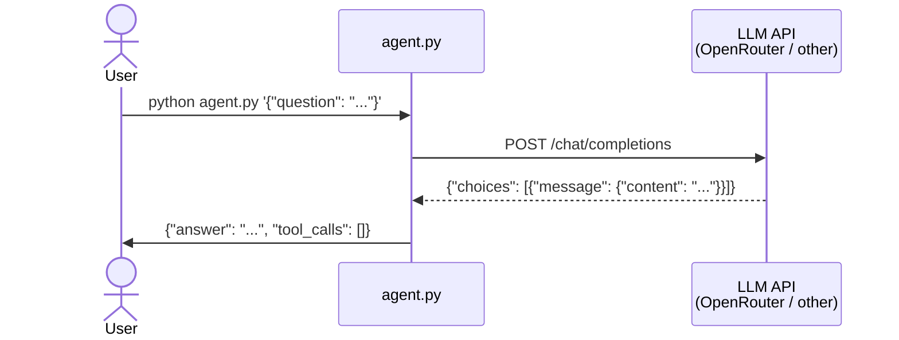

# Basic Agent Loop

<h4>Time</h4>

~60 min

<h4>Purpose</h4>

Build a CLI agent that connects to an LLM and answers questions about the course.

<h4>Context</h4>

You have a fully deployed Learning Management Service — backend, database with analytics data, and a frontend dashboard. Now you will build an **agent**: a Python CLI program that takes a question as input, sends it to a Large Language Model (LLM), and returns a structured JSON answer.

In this task you build the basic loop — no tools yet. The agent should be able to answer general knowledge questions about course topics (Git, REST, Docker, SQL, testing, ETL, agents) using only the LLM's knowledge and a well-crafted system prompt.

<h4>What is an agent?</h4>

An agent is a program that uses an LLM to reason and act. The simplest agent loop is:

```
User question → System prompt + question → LLM API → Answer
```

In later tasks you will extend this to:

```
User question → LLM → Tool call → Execute tool → Feed result back → LLM → Answer
```

<h4>Diagram</h4>



<h4>Table of contents</h4>

- [1. Steps](#1-steps)
  - [1.1. Follow the `Git workflow`](#11-follow-the-git-workflow)
  - [1.2. Create a `Lab Task` issue](#12-create-a-lab-task-issue)
  - [1.3. Plan the implementation](#13-plan-the-implementation)
  - [1.4. Choose an LLM provider](#14-choose-an-llm-provider)
  - [1.5. Build the agent](#15-build-the-agent)
  - [1.6. Test locally](#16-test-locally)
  - [1.7. Document your solution](#17-document-your-solution)
  - [1.8. Add regression tests](#18-add-regression-tests)
  - [1.9. Commit and push your work](#19-commit-and-push-your-work)
  - [1.10. Deploy and test on the VM](#110-deploy-and-test-on-the-vm)
  - [1.11. Finish the task](#111-finish-the-task)
  - [1.12. Check the task using the autochecker](#112-check-the-task-using-the-autochecker)
- [2. Acceptance criteria](#2-acceptance-criteria)

## 1. Steps

### 1.1. Follow the [`Git workflow`](../../../wiki/git-workflow.md)

Follow the [`Git workflow`](../../../wiki/git-workflow.md) to complete this task.

### 1.2. Create a `Lab Task` issue

1. Create a `GitHub` issue titled:

   ```text
   [Task] Basic Agent Loop
   ```

### 1.3. Plan the implementation

Before writing any code, plan the implementation with your coding agent.

1. [Start your coding agent](../../../wiki/coding-agents.md#choose-and-use-a-coding-agent) in the terminal inside the project directory.

2. Ask it to create a plan:

   > "I need to build a CLI agent in Python. It should:
   > - Accept a JSON argument with a `question` field from the command line
   > - Send the question to an LLM API (OpenAI-compatible chat completions)
   > - Include a system prompt with knowledge about course topics
   > - Output a single JSON line to stdout with `answer` and `tool_calls` fields
   > - Send all debug/progress output to stderr only
   >
   > Give me a numbered plan. Don't write code yet."

3. Review the plan. It should cover:
   - Parsing the CLI argument (JSON with `question` field)
   - Making an HTTP request to the LLM API
   - Handling the response
   - Formatting the output as JSON to stdout

> [!IMPORTANT]
> Planning first helps you understand the architecture before writing code.
> A good plan prevents wasted iterations on wrong approaches.

### 1.4. Choose an LLM provider

Your agent needs access to an LLM that supports the OpenAI-compatible chat completions API.

You are free to use any provider. One option is [OpenRouter](https://openrouter.ai), which offers free models — no credit card required.

1. Get an API key from your chosen provider.
2. Find a model that works for you. If using OpenRouter, look for models tagged as `free` that support tool calling (you'll need this in Task 2).
3. Note the API base URL and model name — you'll need them in your agent code.

> [!TIP]
> You can test that your API key works with a simple curl:
>
> ```terminal
> curl <api-base-url>/chat/completions \
>   -H "Authorization: Bearer <your-api-key>" \
>   -H "Content-Type: application/json" \
>   -d '{"model": "<model-name>", "messages": [{"role": "user", "content": "Say hello"}]}'
> ```

> [!NOTE]
> The agent code must read the API key from an environment variable (e.g., `OPENROUTER_API_KEY`).
> Never hardcode API keys in source code.

### 1.5. Build the agent

Now implement the agent. You can use your coding agent to help, but make sure you understand every line.

1. Create `agent.py` in the project root.

2. The CLI interface must be:

   **Input** — a JSON string as the first command-line argument:

   ```bash
   python agent.py '{"question": "What does REST stand for?"}'
   ```

   **Output** — a single JSON line to stdout:

   ```json
   {"answer": "Representational State Transfer.", "tool_calls": []}
   ```

3. Requirements:

   | Requirement | Details |
   |---|---|
   | Input format | JSON string with `question` field as CLI argument |
   | Output format | Single JSON line to stdout with `answer` (string) and `tool_calls` (array) fields |
   | Debug output | All logs, progress, errors go to **stderr only** — stdout must contain only the JSON result |
   | API key | Read from an environment variable, never hardcode |
   | System prompt | Include knowledge about course topics so the LLM can answer without tools |
   | Timeout | The agent must respond within 60 seconds |
   | Exit code | 0 on success |

4. Your system prompt should cover these course topics:

   - **Git**: branches, commits, merging, PRs, issues, workflows
   - **REST**: HTTP methods, status codes, resource naming, authentication vs authorization
   - **Docker**: containers, images, Dockerfile, Docker Compose, volumes
   - **SQL**: SELECT, JOIN, GROUP BY, aggregation functions, CASE WHEN
   - **Testing**: unit tests, e2e tests, test fixtures, pytest
   - **ETL**: extract-transform-load pipelines, pagination, idempotent upserts
   - **Agents**: agentic loops, tool calling, LLM APIs

> [!TIP]
> If using a coding agent to help you build `agent.py`, a good prompt:
>
> "Now implement the agent following the plan. Create `agent.py` in the project root.
> Use the `requests` or `httpx` library to call the LLM API. Read the API key from
> an environment variable. Include a system prompt with course knowledge. Output only
> valid JSON to stdout. Explain each part of the code."

### 1.6. Test locally

1. Set your API key as an environment variable:

   ```terminal
   export OPENROUTER_API_KEY=<your-api-key>
   ```

   Replace with the actual variable name and key for your chosen provider.

2. Test with a simple question:

   ```terminal
   python agent.py '{"question": "What does REST stand for?"}'
   ```

   You should see a single JSON line:

   ```json
   {"answer": "Representational State Transfer.", "tool_calls": []}
   ```

3. Test with more questions to verify the system prompt covers course topics:

   ```terminal
   python agent.py '{"question": "What HTTP method is used to delete a resource?"}'
   python agent.py '{"question": "What does Docker Compose do?"}'
   python agent.py '{"question": "What does ETL stand for?"}'
   ```

4. Verify the output is valid JSON:

   ```terminal
   python agent.py '{"question": "What does REST stand for?"}' | python -m json.tool
   ```

   If this fails, your agent is printing something other than JSON to stdout (debug output should go to stderr).

<details><summary><b>Troubleshooting (click to open)</b></summary>

<h4>Output is not valid JSON</h4>

Make sure all `print()` statements for debug info use `file=sys.stderr`. Only the final JSON result should go to stdout.

<h4>API key error (401/403)</h4>

Check that the environment variable is set correctly: `echo $OPENROUTER_API_KEY`

<h4>Model not found (404)</h4>

Verify the model name matches exactly what your provider expects.

<h4>Timeout or no response</h4>

Check your internet connection. Try the curl test from step 1.4 first.

</details>

### 1.7. Document your solution

Create a brief architecture document that describes your agent's design.

1. Create `AGENT.md` in the project root with:

   - **Architecture**: how the agent works (input → LLM call → output)
   - **LLM provider**: which provider and model you chose, and why
   - **System prompt strategy**: how you structured the system prompt to cover course topics
   - **How to run**: the command and required environment variables

> [!TIP]
> You can ask your coding agent:
>
> "Read `agent.py` and create `AGENT.md` documenting the architecture, LLM provider choice, system prompt strategy, and how to run the agent."

### 1.8. Add regression tests

Write tests that verify your agent produces correct output for a few known questions.

1. Create a test file (e.g., `tests/test_agent.py` or `backend/tests/test_agent.py`).

2. The tests should:
   - Run `agent.py` as a subprocess with a test question
   - Parse the JSON output
   - Verify that `answer` and `tool_calls` fields are present
   - Verify that the answer contains expected keywords

   Example test structure:

   ```python
   import subprocess, json

   def test_rest_question():
       result = subprocess.run(
           ["python", "agent.py", '{"question": "What does REST stand for?"}'],
           capture_output=True, text=True, timeout=60
       )
       assert result.returncode == 0
       output = json.loads(result.stdout)
       assert "answer" in output
       assert "tool_calls" in output
       assert "representational" in output["answer"].lower()
   ```

3. Run your tests to make sure they pass.

> [!NOTE]
> These tests call a real LLM API, so they will use your API key and take a few seconds each.
> Keep the test set small (3–5 questions) to avoid excessive API calls.

### 1.9. Commit and push your work

1. [Commit](../../../wiki/git-workflow.md#commit-changes) your changes.

   Use this commit message:

   ```text
   feat: implement basic agent loop with LLM integration
   ```

2. [Push](../../../wiki/git-workflow.md#push-commits) your task branch:

   ```terminal
   git push -u origin <task-branch>
   ```

   Replace [`<task-branch>`](../../../wiki/git-workflow.md#task-branch).

### 1.10. Deploy and test on the VM

1. On your VM, pull the changes:

   ```terminal
   cd ~/se-toolkit-lab-6
   git fetch origin && git checkout <task-branch> && git pull
   ```

   Replace [`<task-branch>`](../../../wiki/git-workflow.md#task-branch).

2. Install Python dependencies on the VM (if not already done):

   ```terminal
   uv sync
   ```

3. Set the API key on the VM:

   ```terminal
   export OPENROUTER_API_KEY=<your-api-key>
   ```

   > [!TIP]
   > To make the variable persist across SSH sessions, add it to `~/.bashrc`:
   >
   > ```terminal
   > echo 'export OPENROUTER_API_KEY=<your-api-key>' >> ~/.bashrc
   > ```

4. Run the same test questions on the VM:

   ```terminal
   python agent.py '{"question": "What does REST stand for?"}'
   ```

5. Verify the output is valid JSON and the answers are correct.

> [!IMPORTANT]
> The autochecker will SSH into your VM and run `python agent.py '{"question": "..."}'`.
> Make sure the agent works on the VM exactly as it does locally.

### 1.11. Finish the task

1. [Create a PR](../../../wiki/git-workflow.md#create-a-pr-to-the-main-branch-in-your-fork) with your changes.
2. [Get a PR review](../../../wiki/git-workflow.md#get-a-pr-review) and complete the subsequent steps in the `Git workflow`.

### 1.12. Check the task using the autochecker

[Check the task using the autochecker `Telegram` bot](../../../wiki/autochecker.md#check-the-task-using-the-autochecker-bot).

---

## 2. Acceptance criteria

- [ ] Issue has the correct title.
- [ ] `agent.py` exists in the project root.
- [ ] `python agent.py '{"question": "..."}'` outputs valid JSON to stdout with `answer` and `tool_calls` fields.
- [ ] The agent answers course topic questions correctly (Git, REST, Docker, SQL, testing, ETL, agents).
- [ ] The API key is read from an environment variable (not hardcoded).
- [ ] Debug/progress output goes to stderr, not stdout.
- [ ] `AGENT.md` documents the solution architecture.
- [ ] Regression tests exist and pass.
- [ ] The agent works on the VM (accessible via SSH).
- [ ] PR is approved and merged.
